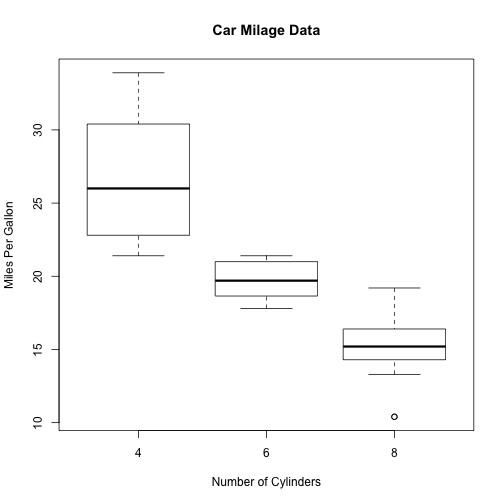

MTCars Evaluator
========================================================
author: S. Philips
date: 
autosize: true


Overview of MTCars Evaluator
========================================================

The MTCars Evlautor has a left panel with sliders for selecting ranges for the QSEC and HP variables.  A boxplot on in the right panel will refresh to show gas mileage of car models in that range. 


```r
boxplot(mpg~cyl,data=mtcars, main="Car Milage Data", 
xlab="Number of Cylinders", ylab="Miles Per Gallon")
```



List of Cars 
========================================================
In addition to the boxplot, a list of cars that fit the values from the sliders will be renderd.


|                  |  mpg| cyl| disp|  hp| drat|    wt|  qsec| vs| am| gear| carb|
|:-----------------|----:|---:|----:|---:|----:|-----:|-----:|--:|--:|----:|----:|
|Mazda RX4         | 21.0|   6|  160| 110| 3.90| 2.620| 16.46|  0|  1|    4|    4|
|Mazda RX4 Wag     | 21.0|   6|  160| 110| 3.90| 2.875| 17.02|  0|  1|    4|    4|
|Datsun 710        | 22.8|   4|  108|  93| 3.85| 2.320| 18.61|  1|  1|    4|    1|
|Hornet 4 Drive    | 21.4|   6|  258| 110| 3.08| 3.215| 19.44|  1|  0|    3|    1|
|Hornet Sportabout | 18.7|   8|  360| 175| 3.15| 3.440| 17.02|  0|  0|    3|    2|
|Valiant           | 18.1|   6|  225| 105| 2.76| 3.460| 20.22|  1|  0|    3|    1|
About the MTCars Data
========================================================

## Motor Trend Car Road Test Data (MTCars)

The MTCars data was extracted from the 1974 Motor Trend US magazine, and comprises fuel consumption and 10 aspects of automobile design and performance for 32 automobiles (1973–74 models).

source: R MTCars Documentation

MTCars Field Definitions
=======

A data frame with 32 observations on 11 variables.

* mpg  - Miles/(US) gallon
* cyl  - Number of cylinders
* disp - Displacement (cu.in.)
* hp   - Gross horsepower
* drat - Rear axle ratio
* wt   - Weight (1000 lbs)
* qsec - 1/4 mile time
* vs   - V/S
* am   - Transmission (0 = automatic, 1 = manual)
* gear - Number of forward gears
* carb - Number of carburetors

source: R MTCars Documentation
